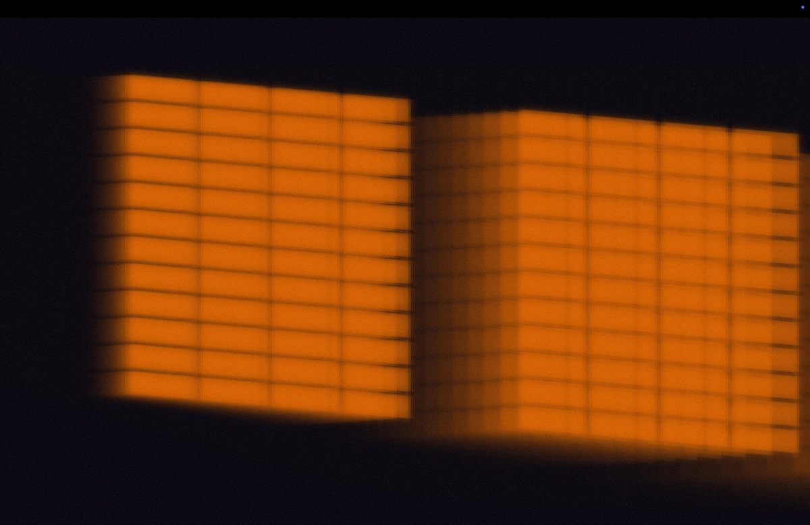

# SUN

## Description

TBC

## Concept / Intent

TBC

## How to Run / Install

This WIP system has been intially designed to be displayed on an immersive, multichannel projection room.  Currently room [G05 at Goldsmiths University](https://facilities.doc.gold.ac.uk/g05/) London.

In order to run the work, a touch designer web plugin was used, this system loads the full 9600x1080 source via a weblink, and splits it out into 5 individual sources at 1920x1080 pixels, one for each of the 5 projectors installed in the G05 facility. 2 on the left wall, one central and a further 2 on the right wall.

Multichannel 9600x1080 source here - https://lab.paulcalver.cc/sun/g05/
Touch Designer Plugin source via Rob Hall - [r.hall@gold.ac.uk](mailto:r.hall@gold.ac.uk)

A simple 2D browser based version can be previewed here - https://lab.paulcalver.cc/sun/web/

As this is still a WIP project, final intalation instructions are not yet available.

## Technology Used

Made using p5.js

Realtime sun path information calculated using an equation that converts Latitude and Longitude inputs into Azimuth and Elevation metrics. 

## Future development

I would like to setup an UI to allow browser based users to select their current location.

For installation developement, I will be looking at asthetic changes to make the windows more organic and authetic. I would also like to explore sound and environmental design. 

## Screenshots / Media

## Credits / Acknowledgements

Paul Calver - Jan 2026  

## Repo

GitHub Repo – https://github.com/paulcalver/sunpath.git  

## Contact Info

Website - https://lab.paulcalver.cc/ 
Social - https://instagram.com/calvercalver 
Email - [paulcalver@me.com](mailto:paulcalver@me.com).