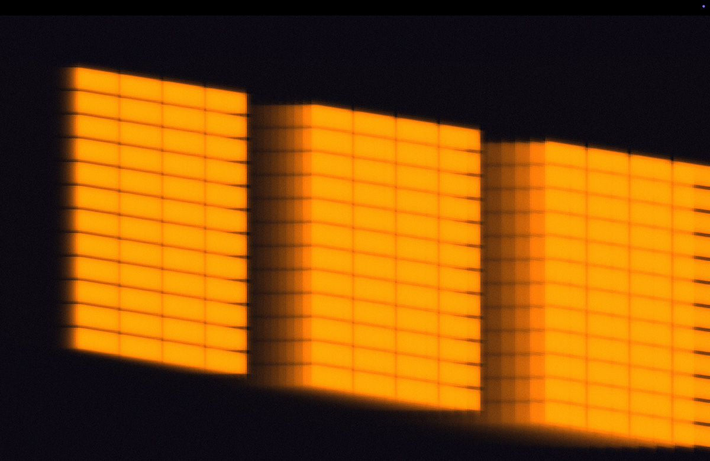

# SUN

## Description

An installation that channels the sun's movement into a controlled environment, making visible the celestial dance that shapes our daily lives.

## Abstract

This work reflects on the profound transformation that technology has made in the context of many of our life experiences, which have in fact become increasingly virtual and mediated. This can lead to a disconnect from the natural world, yet also offers a path back towards reconnection.

Our sun is central to our existence. For millennia, studying the sun's movement enabled profound discoveries: that Earth is spherical (Eratosthenes, 240 BCE), that we orbit the sun rather than sitting at the universe's centre (Copernicus, Galileo), and that our elliptical orbit creates the seasons and influences time itself. Because Earth moves faster when closer to the sun and slower when further away, solar time and clock time drift apart throughout the year by up to 16 minutes. Beyond science, we maintain a strong emotional connection to the sun's presence, as explored in Olafur Eliasson's 2003 work The Weather Project.

My project brings the science and beauty of the sun's movements into sharp yet abstracted focus. Visitors stand in a dark, windowless room where a projected echo of sunlight fades in, as if passing through an absent window. This shape moves around the room as the sun's elevation and azimuth change, mapping our earthly movement in real time.

Whilst technology often drives our disconnect from natural systems, here it serves as a lens to reveal what may have become invisible through that very familiarity. By isolating and amplifying the sun's movement in this controlled environment, the installation aims to retune our attention to the celestial mechanics governing daily life. My hope is that visitors carry this heightened awareness beyond the installation, noticing shifting morning light, lengthening shadows through the seasons, understanding these as evidence of our planet's journey through space. Technology becomes a tool for reconnection, helping us perceive our place within the larger, more-than-human world.

## How to Run / Install

This WIP system has been intially designed to be displayed on an immersive, multichannel projection room.  Currently room [G05 at Goldsmiths University](https://facilities.doc.gold.ac.uk/g05/) London.

In order to run the work, a touch designer web plugin was used, this system loads the full 9600x1080 source via a weblink, and splits it out into 5 individual sources at 1920x1080 pixels, one for each of the 5 projectors installed in the G05 facility. 2 on the left wall, one central and a further 2 on the right wall.

Multichannel 9600x1080 source here - https://lab.paulcalver.cc/sun/g05/

Touch Designer Plugin sourced via Rob Hall at Goldsmiths - [r.hall@gold.ac.uk](mailto:r.hall@gold.ac.uk)

A simple 2D browser based version can be previewed here. Note this requires a desktop computer as it's not currently mobile friendly - https://lab.paulcalver.cc/sun/web/

As this is still a WIP project, final instalation instructions are not yet available.

## Media

Videos of the test installation in Goldsmiths G05 room during the pinup session on 21st Jan 2026

https://github.com/user-attachments/assets/03aea1f0-01c6-4f51-bf25-8e8b32463106

https://github.com/user-attachments/assets/7cdfd886-c3ba-4197-a583-cd4eb49cbaf7

## Technology Used

Made using p5.js

Realtime sun path information calculated using an equation that converts Latitude and Longitude inputs into Azimuth and Elevation metrics. 

## Future development

I would like to setup an UI to allow browser based users to select their current location.

For installation developement, I will be looking at asthetic changes to make the windows more organic and authetic. I would also like to explore sound and environmental design. 

## Credits / Acknowledgements

Paul Calver - Jan 2026  

## Repo

GitHub Repo – https://github.com/paulcalver/sunpath.git  

## Contact Info

Website - https://lab.paulcalver.cc/ 
Social - https://instagram.com/calvercalver 
Email - [paulcalver@me.com](mailto:paulcalver@me.com).
